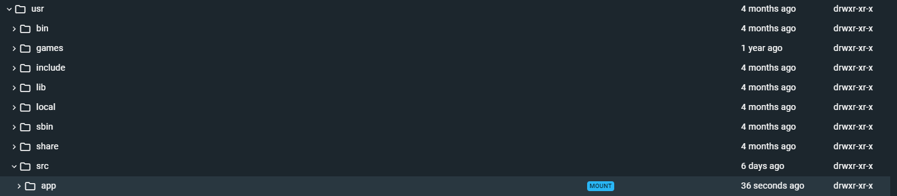

# Commands and Links

## Docker Compose

- `docker compose up --build`
- `docker compose -f docker-compose.yml up --build`
- `docker compose exec web python manage.py migrate --noinput`
- `docker compose exec web python manage.py createsuperuser --email FlynntKnapp@email.app --username FlynntKnapp`

- Application Directory in Docker Container
    